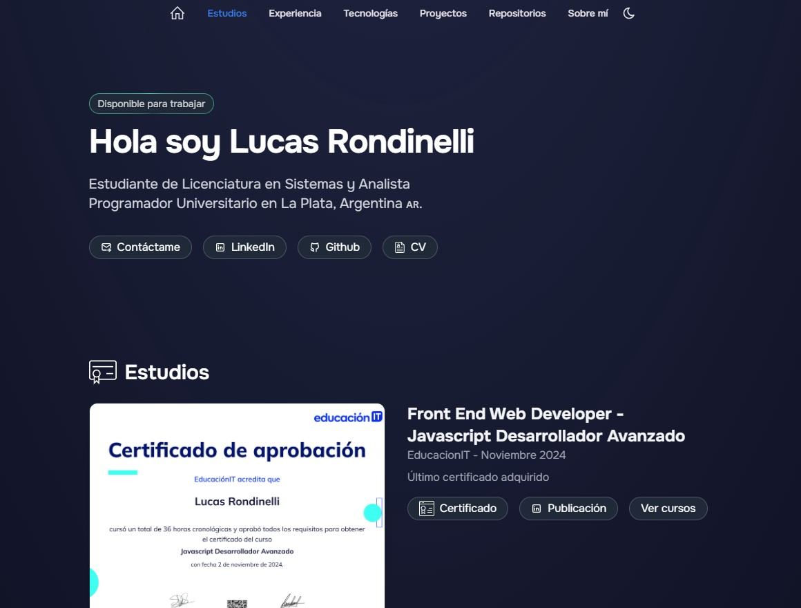

# Portfolio Personal de LRondinelli04

<div align="center">
<a href="https://portfolio-dev-nine-pi.vercel.app/">

</a>
<p></p>
</div>

## Descripción

Este repositorio contiene mi portfolio personal, donde presento una colección de proyectos y experiencias que reflejan mis habilidades y conocimientos en desarrollo de software. Mi objetivo es resaltar mi crecimiento como desarrollador y mi pasión por resolver problemas a través de la tecnología.

## Estructura del Repositorio

- **src/**: Código fuente del portfolio, incluyendo componentes, estilos y configuraciones.
- **public/**: Archivos estáticos como imágenes y otros recursos utilizados en el portfolio.
- **projects/**: Proyectos destacados, cada uno con su propia subcarpeta y archivos relacionados.


## Guía de Inicio
### Para iniciar y ejecutar el portfolio en tu máquina local, sigue estos pasos:

1. Clonar el repositorio:
```sh
   git clone <URL_DEL_REPOSITORIO>
   cd <NOMBRE_DEL_REPOSITORIO>
   ```

2. Instalar dependencias: Asegúrate de tener Node.js y npm instalados. Luego, ejecuta el siguiente comando para instalar las dependencias necesarias:
```sh
   npm install
   ```

3. Intalar dependencias de React
```sh
   npm install react
   ```

4. Iniciar el servidor de desarrollo: Una vez que las dependencias estén instaladas, inicia el servidor de desarrollo con el siguiente comando:
```sh
   npm start
   ```

5. Abrir en el navegador: Abre tu navegador web y navega a `http://localhost:[puerto_disponible]` para ver el portfolio en ejecución.

## Contacto

Puedes encontrarme en <a href="https://www.linkedin.com/in/lucas-rondinelli-9b83a9267">LinkedIn</a>.

